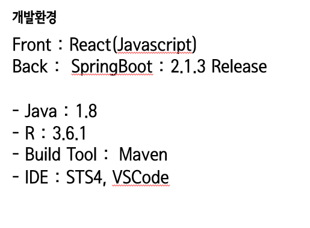
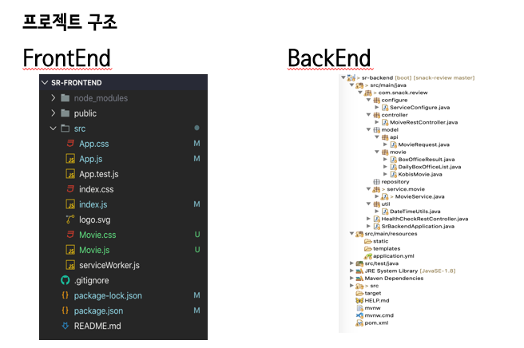
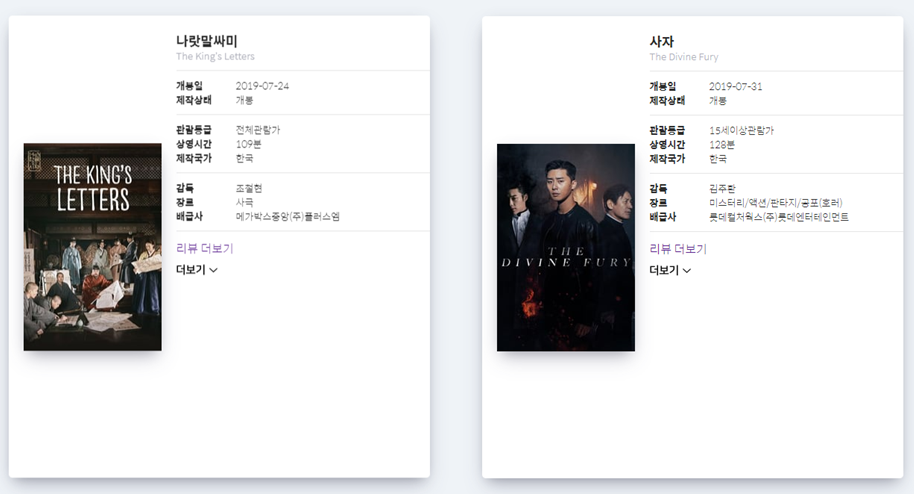
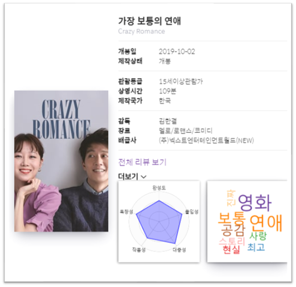
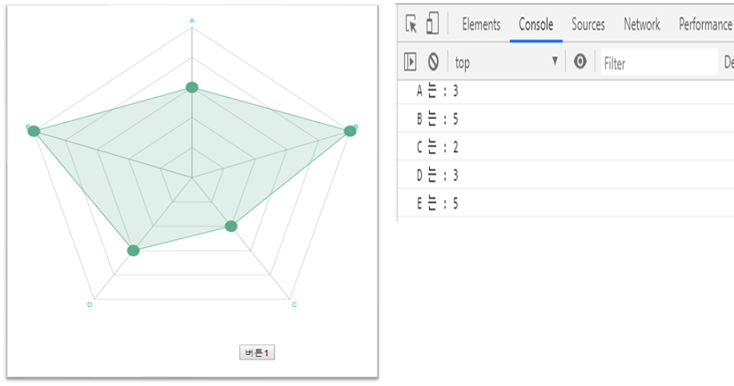

# 스낵리뷰

## 1. 개발 환경

## 2. 프로젝트 구조 

#### 프론트는 리액트, 백엔드는 스프링부트로 구현하여 서로 연동하였다.

## 3. 시연화면

#### 1. 영화 API에서 기본 정보를 가져오고 화면에 출력해줌.

### 2. 시각화 요소 추가

##### *백엔드에서 데이터를 가져오는데까지는 구현 X

#### 3. 미구현 기능

유저에게 레이더로 평점을 입력받아 등록하는 기능은 개발 했지만, 활용 X

# 4. 개선사항

중간에 팀원이 취업준비 때문에 이탈하기도 했고, 주제나 개발환경이 확정되지 않은 상태에서 회의를 한 결과 결과물 보다는 그냥 공부에 의미를 두기로 하고 멀티캠퍼스 과정에서 다루지 않은 리액트와 스프링 부트를 독학하여 간단한 프로젝트를 수행했다.

